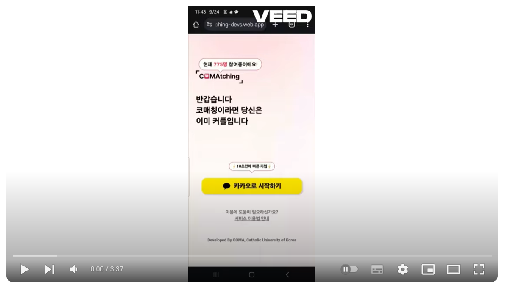
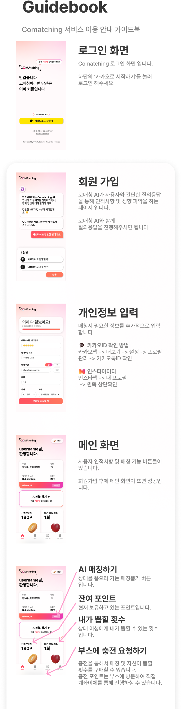

아래는 정리된 **GitHub README.md** 파일입니다. 불필요한 중복을 제거하고 논리적 흐름에 따라 내용을 재구성했습니다.

---

# COMAtching  

**COMAtching**은 사용자의 취미, 성향, 선호도를 기반으로 최적의 매칭을 제공하는 웹 애플리케이션입니다.  
이 프로젝트에서 **프론트엔드**를 담당했으며, 주요 기술 스택으로 `React`, `Vanilla CSS`, `Recoil`, `Firebase` 등을 사용했습니다.

---

## 🚀 **프로젝트 시연**

[](https://www.youtube.com/watch?v=jDAygPgQty0&t=55s)

---

## 🔧 **주요 기능**  

1. **카카오 로그인**  
   - 사용자가 **카카오 로그인을 통해 손쉽게 접속**할 수 있습니다.  

2. **사용자 취미 선택**  
   - 사용자가 취미 및 활동을 선택하여 **맞춤형 프로필**을 생성합니다.  

3. **매칭 결과 확인**  
   - 선택된 조건(취미, 나이 등)에 따라 **최적의 매칭 결과**를 확인합니다.  

4. **밀어서 커플되기 기능**  
   - 사용자가 버튼을 **드래그**하여 직관적으로 매칭을 진행하고 조건을 확인할 수 있습니다.  

5. **브라우저 리디렉션 처리**  
   - 카카오톡과 같은 **인앱 브라우저**에서 링크를 열 경우 **크롬** 등 외부 브라우저로 리디렉션됩니다.  

6. **관리자 페이지**  
   - 관리자 전용 페이지에서 **충전 요청**을 실시간으로 확인 및 처리할 수 있습니다.  

---

## 🖥️ **배포**  

Firebase Hosting을 통해 COMAtching을 배포했습니다.  

🔗 [COMAtching 배포 링크](https://comatching-devs.web.app/)

---

## ⚙️ **기술 스택**  

- **React**: 컴포넌트 기반 사용자 인터페이스  
- **Vanilla CSS**: 일관된 디자인과 깔끔한 스타일링  
- **Recoil**: 글로벌 상태 관리 라이브러리  
- **Axios**: 서버와의 효율적인 통신 (API 요청 및 응답 처리)  
- **SockJS & Stomp.js**: 실시간 WebSocket 통신을 위한 라이브러리  
- **Firebase Hosting**: 안정적이고 빠른 웹 서비스 배포  

---

## 📂 **파일 구조**  

```plaintext
src/
├── pages/                       # 주요 페이지 컴포넌트
│   ├── Mainpage.jsx             # 메인 페이지
│   ├── Hobbyform.jsx            # 취미 선택 페이지
│   ├── Matchresult.jsx          # 매칭 결과 페이지
│   ├── Adminpage_unlogin.jsx    # 관리자 로그인 페이지
│   └── User_info_page.jsx       # 사용자 정보 페이지
│
├── components/                  # 재사용 가능한 UI 컴포넌트
│   └── AdminRequestList.jsx     # 관리자 요청 리스트
│
├── recoil/                      # Recoil 상태 관리
│   ├── userState.js             # 사용자 상태 관리
│   ├── adminRequests.js         # 관리자 요청 상태
│   └── MatchResultState.js      # 매칭 결과 상태
│
├── App.js                       # 메인 루트 컴포넌트
├── axiosConfig.js               # Axios 설정 파일
└── ...
```

---

## 📡 **실시간 WebSocket 통신 - 관리자 충전 요청 관리**  

**SockJS**와 **Stomp.js**를 사용해 **실시간 WebSocket 통신**을 구현했습니다. 이를 통해 충전 요청 및 승인/취소 이벤트가 실시간으로 반영됩니다.

### **주요 기능**  

1. **충전 요청 실시간 구독**  
   - 서버의 `/topic/chargeRequests`를 구독해 **새로운 요청**을 실시간으로 업데이트합니다.  

2. **승인 및 취소 처리**  
   - `/topic/approvalUpdate`와 `/topic/cancelUpdate`를 구독하여 **요청 상태**를 즉시 변경합니다.  

3. **토큰 기반 인증**  
   - 쿠키에서 `Authorization` 토큰을 가져와 **WebSocket 연결 시 인증**합니다.  

---

### **주요 코드**

#### **1. WebSocket 연결 및 구독**  

```javascript
useEffect(() => {
  const socket = new SockJS("https://cuk.comatching.site/wss");
  const client = Stomp.over(socket);
  const token = getTokenFromCookie();

  if (!token) {
    navigate("/adminlogin");
    return;
  }

  client.connect({ Authorization: `Bearer ${token}` }, (frame) => {
    console.log("Connected: " + frame);

    client.subscribe("/topic/chargeRequests", (message) => {
      const chargeRequests = JSON.parse(message.body);
      setRequests((prev) => [
        ...prev,
        ...chargeRequests.filter((req) => !prev.some((r) => r.userId === req.userId)),
      ]);
    });

    client.subscribe("/topic/approvalUpdate", (message) => {
      const userId = message.body;
      setRequests((prev) => prev.filter((req) => req.userId !== userId));
    });
  });
}, []);
```

#### **2. 쿠키에서 토큰 가져오기**  

```javascript
function getTokenFromCookie() {
  const name = "Authorization=";
  const decodedCookie = decodeURIComponent(document.cookie);
  const ca = decodedCookie.split(";");
  for (let i = 0; i < ca.length; i++) {
    let c = ca[i].trim();
    if (c.indexOf(name) === 0) {
      return c.substring(name.length, c.length);
    }
  }
  return "";
}
```

---

## 🛠️ **Recoil 상태 관리**  

Recoil을 사용해 전역 상태를 관리합니다.

### **사용자 상태 예시**  

```javascript
import { atom } from "recoil";

export const userState = atom({
  key: "userState",
  default: {
    username: "",
    age: "",
    mbti: "",
    hobby: [],
    point: 0,
  },
});
```

---

## 📚 **사용된 라이브러리**  

- **SockJS**: WebSocket 연결 및 브라우저 호환성  
- **Stomp.js**: WebSocket 메시지 전송 및 구독  
- **Clipboard API**: 클립보드에 텍스트 복사 기능  
- **Axios**: API 통신  
- **Recoil**: 상태 관리 라이브러리  

---

## 🖼️ **프로젝트 이미지**  

  
  

---

이 문서는 프로젝트의 주요 기능과 기술적 구현을 명확하고 간결하게 설명합니다.  

> **최종 배포 링크**: [COMAtching](https://comatching-devs.web.app/) 🚀  
